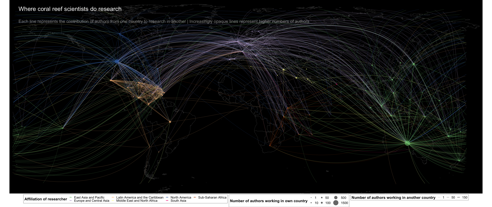
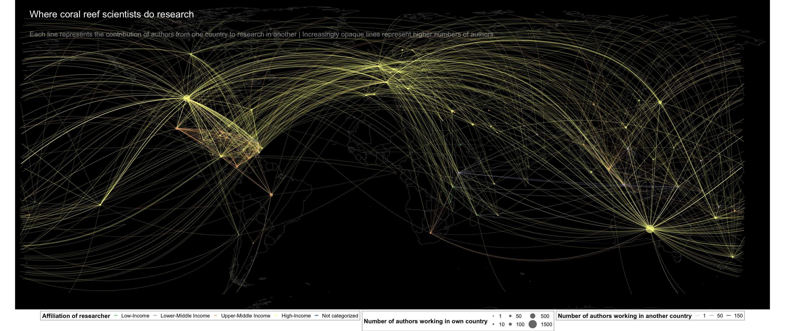

```{r setup, include=FALSE}
knitr::opts_chunk$set(echo = TRUE)
library(dplyr)
library(tidyr)
library(ggplot2)
library(wordcloud)
library(RColorBrewer)
library(tm)
library(maptools)
library(rgdal)
library(broom)
library(mapproj)
library(viridis)
library(knitr)
library(scales)
library(cowplot)
library(forcats)
library(ggpubr)
library(geosphere)
```

## Introduction

The goal of this project is to examine patterns in author diversity (gender/geographic) in coral reef publications over the past 15 years. We selected a range of peer-reviewed scientific journals across different impact factors and levels (incl. Conservation Letters, PNAS, Proceedings of the Royal Society B, Coral Reefs, PlosOne, Marine Policy, Marine Biology, Frontiers in Marine Science, Nature, Science). A team of global coral reef scientists reviewed these articles and extracted relevant data on research area, geography, authorship, and gender.

<span style="color: purple;">
**Notes for co-authors to consider are in bold purple**
</span>

```{r data, include=FALSE}
df2 <- readRDS("final_data_for_analysis_03022020.rds")

##Remove 2019
df2 <- df2 %>% filter(Pub_year != 2019)
```

## Methods
### Search strategy
Ten journals were selected that publish coral reef content, representing a range of different impact factors and levels. Searches were conducted in Web of Science in 2019 using the following search string: <span style='color:purple;">**David G. can you send the search string?**</span>. The bibliographic information from the 1675 search results were extracted from Web of Science and cleaned and formatted for coding using a custom R script.

### Data coding
*Order of authors* (e.g. first, last, etc...) was coded using a custom R script based on Web of Science records.

The following meta-data field were derived from Web of Science records: *author name, institutional affiliation, country of affiliation, title of study, abstract, publication year, DOI, times cited, journal name*.

Reef area was derived from <span style='color:purple;'>**Gabby can you provide info on where the reef area data came from?**</span>

A team of reviewers worked collaboratively to code information about authors and studies. The following information on authors was coded for **each author** listed on a paper: *identified gender, and whether the author was based in the country of study*. The following information was coded from **each study**: *country(countries) of study, study region, whether the study took place in a territory of another sovereign nation or a disputed territory, study type, marine realm of study* (Table 1).

* **Gender**: The following decision process was used to determine author gender: 1) Each author was searched in Google. 2). Based on their online profiles, reviewers made a determination on gender based on stated pronouns. In the abscence of pronouns, reviewers based their decision on photographs and consultation with others on the author team who may know an author personally. 3). If no determination could be made, gender was entered as "undetermined." For authors that could not be located online, gender was entered as "not found." We recognize that the method of determining gender is imprecise and may underrepresent individuals who identify as non-binary. Our aim with this study is to highlight gender representation issues in coral reef science, not to provide a precise tabulation of gender composition. Thus, the gender categories we code for are a heuristic estimate of gender in the field.
* **Study country**: Based on the abstract and/or full text, reviewers coded what country the study took place in. For studies in more than 5 countries, studies were coded for a study region instead. For overseas territories, study country was coded as the sovereign nation.
* **Study region**: Region where study took place, also includes global studies
* **Study type**: Studies could be coded for multiple types including fieldwork, modeling, synthesis, laboratory, and desk studies
* **Marine realm**: Marine realm (using the Marine Ecoregions of the World typology) of study
* **Is the author based in the country of study?**: Based on the author's institutional affiliation for each study, reviewers coded this field as "yes", "no", or "NA" depending on whether the country of affiliation is same as the country of study

### Data analysis
Summary statistics on characteristics of the evidence base along with change in number of authors, gender, and diversity over time were calculated in R.

We examined gender representation by looking at 4 metrics: author position (first, last), single author papers, and proportion of publication output contributed by men vs. women) across a number of different variables (publication year, country of affiliation, marine realm studied, study type, times cited, and journal). **Proportion of each gender's output was calculated by comparing the proportion of identified authorships for each gender in a given article. For example, if a paper had 9 authors, of which 8 were identified to gender, each authorship was granted an equal share of authorship (1/8 each). These fractions were then aggregated at different levels (e.g. countries, study_types, journals) to explore gender contributions. These reflect authorships and not individuals.**

We recognize that diversity is a multi-faceted concept and can be understood in many different ways. In this analysis, we use institutional affiliation as a proxy for diversity and as a way to understand national and international collaboration in the study of coral reefs. We realize that individuals who may identify ethnically, racially, and/or in terms of nationality, may be affiliated with institutions that are in other countries/regions, thus, again, this is a heuristic estimate of diversity. We examined diversity of authors by looking at how often authors were involved in national vs. international collaborations, how often "in-house" research occurs in different countries (national authors leading/contributing to studies in country), and how often authors from different regions did research in other regions. We also examined the cross-section of diversity and gender.

## Characteristics of the evidence base

```{r include = FALSE}
n <- n_distinct(df2$Article.ID)
j <- unique(df2$Journal)
y <- c(min(df2$Pub_year):max(df2$Pub_year))
a <- unique(df2$Author)
c <- unique(df2$Country_affiliation)
```
This study considered ``r n`` unique studies published between ``r y[1]`` and ``r y[16]``.
This dataset represents works by ``r length(a)`` authors from ``r length(c)`` different countries. <span style="color: purple;">**The number of unique authors is going to be wrong as names were not standardized between databases). We need to decide whether we want to spend time cleaning this or not. Variations include Last,First; First Last; Last, First Initial**</span>

```{r gg, echo=FALSE, fig.fullwidth=TRUE}
growth <- df2 %>% select(Article.ID,Pub_year,Journal) %>% distinct()
g <- count(growth,Pub_year,Journal)

gg <- ggplot(g, aes(Pub_year,n,fill=Journal)) + 
  geom_bar(stat="identity") +
  scale_x_continuous(breaks=seq(2003,2018,1), name="Publication year") +
  scale_y_continuous(breaks=seq(0,200,50), name="Number of articles") +
  scale_fill_brewer(palette="Set3",
                    name="",
                      breaks=c("CONSERVATION LETTERS","CORAL REEFS","FRONTIERS IN MARINE SCIENCE","MARINE BIOLOGY","MARINE ECOLOGY PROGRESS SERIES","MARINE POLICY","NATURE","PLOS ONE","PROCEEDINGS OF THE NATIONAL ACADEMY OF SCIENCE OF THE UNITED STATES OF AMERICA","PROCEEDINGS OF THE ROYAL SOCIETY B-BIOLOGICAL SCIENCES","SCIENCE"),
                      labels=c("Cons. Letters","Coral Reefs","Frontiers Mar. Sci.","Marine Biology","MEPS","Marine Policy","Nature","PlosOne","PNAS","ProcB","Science")) +
  theme(
    axis.text.x=element_text(angle=45,hjust=1),
    legend.position = c(0.1,0.7),
    legend.background = element_blank()
  )
  
plot(gg)
```

<span style="color: darkblue;">**Figure 1.** Growth in coral reef publications over the last 15 years, disaggregated by journal. MEPS = Marine Ecology Progress Series, PNAS = Proceedings of the National Academy of Sciences, ProcB = Proceedings of the Royal Society B-Biological Sciences.</span>

```{r cc, include=FALSE}
##Plot countries
#load in full country list
country <- read.csv("country_code_web.csv", head=TRUE, sep=",")
names(country) <- c("Study_country", "Code","Territory","Sovereignty","Latitude","Longitude","Reef_area","Region","Income")
country$Study_country <- as.character(country$Study_country)

##Count number of studies for all countries and arrange by region
country_count <- matrix(nrow=nrow(country), ncol=2)
rownames(country_count) <- country$Study_country
colnames(country_count) <- c("Study_country", "counts")

df_country <- df2 %>% select(Article.ID,Mapping_Country) %>% filter(!is.na(Mapping_Country)) %>% distinct()

#Calculate in for loop and write to blank matrix
for (c in country$Study_country){
  subset <- filter(df_country, Mapping_Country == c)
  country_count[c,1] <- c
  country_count[c,2] <- as.numeric(n_distinct(subset$Article.ID))
}
#Remove rownames and reformat data types
rownames(country_count) = NULL
country_count <- as.data.frame(country_count, stringsAsFactors=FALSE)
countries <- left_join(country,country_count,by="Study_country")

countries$counts <- as.numeric(countries$counts)
countries <- as.data.frame(countries)
countries_zero <- filter(countries, counts == 0)

countries <- arrange(countries,desc(counts))

map <- readShapeSpatial("TM_WORLD_BORDERS-0.3/TM_WORLD_BORDERS-0.3.shp")
map <- fortify(map, region="ISO3")

```

Research was conducted in ``r nrow(filter(countries, counts !=0 & Territory == "N"))+2`` countries and ``r nrow(filter(countries, counts !=0 & Territory == "Y"))`` territories. The most studied countries were ``r countries[1,1]`` (n=``r countries[1,5]``) and ``r countries[2,1]`` (n=``r countries[2,5]``). The figure below shows the geographic distribution of research effort in terms of areas under study (using any type of method, e.g. field studies, laboratory, and desk studies).

```{r cc_plot_alt, fig.height=7, fig.width=12, echo=FALSE}
##Define custom breaks for choropleth map
##Define custom breaks for choropleth map
min <- min(countries$counts) 
max <- max(countries$counts)
pretty_breaks <- c(5,25,50,100,250)
brks <- c(min,pretty_breaks,max)
#labels <- c("1-5","6-25","26-50","51-100","101-250","251-459")
labels <- c()
for(i in 1:length(brks)){
  labels <- c(labels,round(brks[i + 1], 2))
}
labels <- labels[1:length(labels)-1]

countries$brks2 <- cut(countries$counts,
                      breaks=brks,
                      include.lowest=TRUE,
                      labels=labels)

brks_scale <- levels(countries$brks2)
labels_scale <- brks_scale

cc <- ggplot() + 
  geom_map(data=countries, aes(map_id=Code, fill=brks2),map=map) + 
  geom_map(data=countries_zero, aes(map_id=Code),fill="#f0f0f0",map=map) + 
  expand_limits(x=map$long,y=map$lat) + 
  theme(panel.background = element_rect(fill = "grey50", colour = "white"), panel.grid.major = element_blank(), panel.grid.minor = element_blank()) +
  coord_equal() +
  theme(legend.position = "bottom")


cd <- cc +
  scale_fill_manual(
    values=(brewer.pal(7, "BuGn")[2:7]),
    breaks=brks_scale,
    name="Number of articles",
    drop=FALSE,
    labels=labels_scale,
    guide=guide_legend(
      direction="horizontal",
      #keyheight= unit(2, units="mm"),
      #keywidth = unit(70/length(labels), units="mm"),
      title.position = "top",
      title.hjust = 0.5,
      label.hjust = 1,
      nrow=1,
      byrow=T,
      reverse=F,
      label.position="bottom"
      )
    )

plot(cd)
```
<span style="color: darkblue;">***Figure 2.** Geographic distribution of study countries with discrete breaks.</span>


When we examine the geographic distribution of field-based research in relation to reef area - we see that some of the countries with greatest reef area (e.g. Indonesia and the Philippines) have similar levels of research efforts as countries with much smaller reef area (e.g. French Polynesia and Mexico). In comparison, the United States has significantly high research effort in comparison to reef area.

```{r reef_area, echo=FALSE}
reef_area <- countries %>% select(Study_country,Reef_area,counts) %>% filter(!is.na(Reef_area))
rownames(reef_area) <- reef_area$Study_country
ra <- ggplot(reef_area, aes(x=Reef_area,y=counts)) +
  geom_point(
    color="blue",
    fill="#14B1CD",
    shape=21,
    alpha=0.5,
    size=2,
    stroke=0.25
  ) +
  geom_text(
    label=reef_area$Study_country,
    nudge_x = 0.25,
    nudge_y = 0.25,
    check_overlap=T
  ) +
  ylab("Number of articles") +
  xlab("Reef area (km2)")

plot(ra)
```

<span style="color:darkblue;">**Figure 3.** Distribution of articles across reef area by country.</span>


```{r mar_region, include=FALSE}
#Plot marine realms
#m_lyr <- readOGR(dsn="MEOW-TNC", layer="meow_ecos",verbose=FALSE)
#m_lyr_fortified <- tidy(m_lyr,region="REALM")

##Plot countries
#map_lyr <- readOGR(
#  dsn="TM_WORLD_BORDERS-0.3",
#  layer="TM_WORLD_BORDERS-0.3",
#  verbose=FALSE
#)

#ggmap <- tidy(map_lyr,region="ISO3")

#Clean marine realm data
realm <- df2 %>% select(Article.ID,Marine_realm) %>% distinct() %>% filter(Marine_realm != "")
realm$Marine_realm <- gsub(", ",",", realm$Marine_realm)
realm$Marine_realm <- as.character(realm$Marine_realm)
m <- strsplit(realm$Marine_realm, split=",")
m_df <- data.frame(ID=rep(realm$Article.ID, sapply(m, length)), id = unlist(m))
colnames(m_df) <- c("Article.ID","id")
m_df <- distinct(m_df)

#Count studies per realm
marine_count <- count(m_df,id)
marine_count$id <- as.character(as.factor(marine_count$id))
#marine_data <- m_lyr_fortified %>% left_join(marine_count, by="id")
marine_data <- marine_count
marine_data$n[is.na(marine_data$n)] <- 0
marine_data_zero <- marine_data %>% filter(n == 0)
marine_data <- marine_data %>% filter(n != 0)

#Summarized in a table
marine_data_summary <- marine_data %>% select(id, n) %>% distinct() %>% arrange(desc(n))
```

The majority of studies were conducted in the Central Indo-Pacific (n=691 articles) and the Tropical Atlantic (including the Caribbean) (n=331). In comparison, there were considerably fewer studies in the Eastern (n=200) and Western (n=148) Indo-Pacific.

In general, the majority of studies in the evidence base were field-based (n=1066 articles) while a smaller number were lab-based (n=487) or used modelling (n=144) and/or synthesis (n=129) approaches.Research topics were wide-ranging (Figure 4).

<span style="color: purple;">
**Not even sure if this is useful, removed common words such as "coral*" and "reef*" to get a better picture of what about coral reefs was being studied. This is mapping the frequency of words (excluding stopwords) from the title and abstracts.**
</span>

```{r ta, include = FALSE}
#Create corpus of titles and abstracts
ta <- df2 %>% select(Article.ID,Title,Abstract) %>% distinct() %>% unite("Text",c("Title","Abstract"),sep="; ")
text <- ta$Text
docs <- Corpus(VectorSource(text))
#Clean corpus
docs <- docs %>%
  tm_map(removeNumbers) %>%
  tm_map(removePunctuation) %>%
  tm_map(stripWhitespace)
docs <- tm_map(docs, content_transformer(tolower))
docs <- tm_map(docs, removeWords, stopwords("english"))
docs <- tm_map(docs, removeWords, c("coral","corals","reefs","reef"))

#Create document-term-matrix
dtm <- TermDocumentMatrix(docs) 
matrix <- as.matrix(dtm) 
words <- sort(rowSums(matrix),decreasing=TRUE) 
wc <- data.frame(word = names(words),freq=words)
```

```{r ta_plot, echo=FALSE}
#Generate word cloud
set.seed(1234) 
wordcloud(words = wc$word, freq = wc$freq, min.freq = 10,
          max.words=200, random.order=FALSE, rot.per=0.35,
          colors=brewer.pal(8, "Dark2"), scale=c(2.5,0.25))

```

<span style="color:darkblue;">**Figure 4.** Wordcloud of frequent words appearing in titles and abstracts.</span>
```{r st, include=FALSE, echo=FALSE}
###Types of studies
##What study types are encountered?
type <- df2 %>% select(Article.ID,Study_Type) %>% distinct()
type_count <- count(type,Study_Type) %>% arrange(desc(n))

# st <- ggplot(type_count, aes(Study_Type,n)) + 
#   geom_col(fill="steelblue") +
#   scale_y_continuous(breaks=seq(0,1100,100), name="Number of articles") +
#   xlab("Study type") +
#   theme(
#     axis.text.x=element_text(angle=45,hjust=1)
#   )
# 
# plot(st)
```

## Author characteristics

```{r gender, include=FALSE}
#Percent authors successfully identified and summary stats
authors <- df2 %>% select(Author_gender,Author) %>% distinct()
n_a <- n_distinct(authors$Author)
gender_stats <- count(authors,Author_gender)
```

This study found a maximum of ``r n_a`` unique authors in the evidence base. This number represents the maximum number of authors as different publication databases listed authors in different formats and thus we were unable to de-duplicate entries that were not an exact match (e.g. Last Name, First Name vs. Last Name, First Initial). 

### Gender representation in coral reef authors

``r gender_stats[3,2]`` authors could not be located on the internet to confirm gender identity. Authors whose gender identity could not be reliably determined based on the presence of identified pronouns, declarations, or author(s) knowledge - were coded as "undetermined." The majority of authors in coral reef science are male.

```{r gender_stats, fig.hold='hold', out.width="50%", echo=FALSE}
gs_plot <- filter(gender_stats,Author_gender != "Not found")
gs <- ggplot(gs_plot, aes(x="",y=n,fill=Author_gender)) +
  geom_bar(width=1, stat="identity") +
  scale_fill_brewer(palette="Accent") +
  theme_minimal() +
  theme(
    axis.title.x = element_blank(),
    axis.ticks.x = element_blank(),
    panel.grid = element_blank(),
    legend.position='left') +
  geom_text(aes(y=n, label=percent(n/n_a)), size=3, position=position_stack(vjust=0.5)) +
  ylab("Number of authors") +
  guides(fill=guide_legend(title="Gender"))

ratio <- df2 %>% select(Article.ID,Author_gender,First_last) %>% distinct()
x <- n_distinct(ratio$Article.ID)
rg <- count(ratio,Author_gender,First_last) %>% filter(First_last != "other")

gp <- ggplot(rg, aes(x=First_last,y=n)) +
  geom_bar(aes(fill=Author_gender), stat="identity", position=position_dodge()) +
  scale_fill_brewer(palette="Accent") +
  theme_minimal() +
  theme(
    axis.ticks.x = element_blank(),
    legend.position='none') +
  ylab("Number of articles") +
  xlab("Author position") +
  guides(fill=guide_legend(title="Gender"))

par(mar = c(4,4,0.1,0.1))
plot(gs)
plot(gp)
```
<span style="color:darkblue;">**Figure 5 & 6** (Left) Gender distribution of authors in coral reef science. (Right) Frequency of male vs. female authors in first, last, and all other author positions'</span>

### Gender diversity trends

The following displays patterns in gender by looking at 4 metrics: author position (first, last), single author papers, and proportion of publication output contributed by men vs. women) across a number of different variables (publication year, country of affiliation, marine realm studied, study type, times cited, and journal).

<span style="color: purple;">
**Proportion of each gender's output was calculated by comparing the proportion of identified authorships for each gender in a given article. For example, if a paper had 9 authors, of which 8 were identified to gender, each authorship was granted an equal share of authorship (1/8 each). These fractions were then aggregated at different levels (e.g. countries, study_types, journals) to explore gender contributions. These reflect authorships and not individuals.**
</span>

```{r ge_data, include=FALSE}
##Summarize gender over different variables
##Remove undetermined and not found entries
gender_mf <- df2 %>% filter(Author_gender != "Undetermined" & Author_gender != "Not found")
```

### Trends over time

Over time, the proportion of female to male authors in first author position has slightly shifted closer to a balance. However, the proportion of female to male authors in last author position has remained low over time despite an increase in the number of articles published. Single author studies varied significantly over time (Figure 7). In comparison, when looking at the change in individual contribution of all authors to coral reef research, we see that the field remains dominated by male authors with contribution to published articles per year remaining below 50% (Figure 8).

```{r gender_time, echo=FALSE}
##Over time
#Proportion (overall male vs. female contribution)
gp_year <- gender_mf %>% select(Article.ID,Author_gender,Author,Pub_year,Prop_authorship) %>% distinct()
gpy <- aggregate(gp_year$Prop_authorship, by=list(Year=gp_year$Pub_year,Gender=gp_year$Author_gender), FUN=sum)

#Author position
gc_year <- gender_mf %>% select(Article.ID,Author_gender,First_last,Pub_year) %>% filter(First_last != "other") %>% distinct() %>% group_by(Pub_year,First_last)
gcy <- count(gc_year,Pub_year,Author_gender,First_last)

##Plotting
ggplot(gcy, aes(Pub_year,n)) + 
  geom_col(aes(fill=Author_gender),position=position_stack()) +
  facet_grid(rows=vars(First_last), scales="free") +
  scale_x_continuous(breaks=seq(2003,2018,1), name="Publication year") +
  ylab("Number of articles") +
  theme(
    axis.text.x=element_text(angle=45,hjust=1),
    legend.position='bottom') +
  scale_fill_brewer(palette = "Accent") +
  guides(fill=guide_legend(title="Gender"),
         guide=guide_legend(
           direction="horizontal",
           #keyheight= unit(2, units="mm"),
           #keywidth = unit(70/length(labels), units="mm"),
           title.position = "top",
           title.hjust = 0.5,
           label.hjust = 1,
           label.position="bottom"
         ))
```

<span style="color:darkblue;">**Figure 7.** Change in composition of gender in first, last, and single author positions over time.</span>

```{r gender_prop_time, echo=FALSE}
ggplot(gpy, aes(Year,x)) + 
  geom_col(aes(fill=Gender),position=position_stack()) +
  scale_x_continuous(breaks=seq(2003,2018,1), name="Publication year") +
  scale_y_continuous(breaks=seq(0,200,10), name="Number of published articles") +
  theme(
    axis.text.x=element_text(angle=45,hjust=1)
  ) +
  theme(
    legend.position='bottom') +
  scale_fill_brewer(palette = "Accent") +
  guides(fill=guide_legend(title="Gender"),
         guide=guide_legend(
           direction="horizontal",
           #keyheight= unit(2, units="mm"),
           #keywidth = unit(70/length(labels), units="mm"),
           title.position = "top",
           title.hjust = 0.5,
           label.hjust = 1,
           label.position="bottom"
         ))
```

<span style="color:darkblue;">**Figure 8.** Change in individual contribution of genders to published articles over time.</span>

### Trends in different journals

Across all journals, authorship was dominated by males. In the journals with more coral reef articles (e.g. Coral Reefs and Plos One) - gender representation of females is higher (Figures 9 and 10).

```{r journal_gender, echo=FALSE,fig.hold="hold",out.width="50%"}
##By Journal
#Proportion (overall male vs. female contribution)
gender_mf$Journal[gender_mf$Journal == "PROCEEDINGS OF THE NATIONAL ACADEMY OF SCIENCES OF THE UNITED STATES OF AMERICA"] <- "PNAS"
gender_mf$Journal[gender_mf$Journal == "PROCEEDINGS OF THE ROYAL SOCIETY B-BIOLOGICAL SCIENCES"] <- "ProcB"
gender_mf$Journal[gender_mf$Journal == "MARINE ECOLOGY PROGRESS SERIES"] <- "MEPS"

gp_journal <- gender_mf %>% select(Article.ID,Author_gender,Author,Journal,Prop_authorship) %>% distinct()
gpj <- aggregate(gp_journal$Prop_authorship, by=list(Journal=gp_journal$Journal,Gender=gp_journal$Author_gender), FUN=sum) %>% mutate(Journal = fct_reorder(Journal, desc(x)))

#Author position
gc_journal <- gender_mf %>% select(Article.ID,Author_gender,First_last,Journal) %>% filter(First_last != "other") %>% distinct()
gcj <- count(gc_journal,Journal,Author_gender,First_last) %>% mutate(Journal = fct_reorder(Journal, desc(n)))

##Plotting
ggplot(gcj, aes(Journal,n)) + 
  geom_col(aes(fill=Author_gender),position=position_stack()) +
  facet_grid(rows=vars(First_last), scales="free") +
  ylab("Number of articles") +
  xlab("Journal") +
  theme(
    axis.text.x=element_text(angle=45,hjust=1),
    legend.position='none') +
  scale_fill_brewer(palette = "Accent") +
  guides(fill=guide_legend(title="Gender"),
         guide=guide_legend(
           direction="horizontal",
           #keyheight= unit(2, units="mm"),
           #keywidth = unit(70/length(labels), units="mm"),
           title.position = "top",
           title.hjust = 0.5,
           label.hjust = 1,
           label.position="bottom"
         ))

ggplot(gpj, aes(Journal,x)) + 
  geom_col(aes(fill=Gender)) +
  scale_y_continuous(breaks=seq(0,1100,50), name="Number of published articles") +
  theme(
    axis.text.x=element_text(angle=45,hjust=1),
    legend.position='bottom') +
  xlab("Journal") +
  scale_fill_brewer(palette = "Accent") +
  guides(fill=guide_legend(title="Gender"),
         guide=guide_legend(
           direction="horizontal",
           #keyheight= unit(2, units="mm"),
           #keywidth = unit(70/length(labels), units="mm"),
           title.position = "top",
           title.hjust = 0.5,
           label.hjust = 1,
           label.position="bottom"
         ))
```
<span style="color:darkblue;">**Figures 9 & 10.** Gender representation in published articles in 10 journals disaggregated by (left) author position and (right) individual contributed to published articles.</span>

### Gender representation in different types of studies

```{r study_gender, echo=FALSE,fig.hold='hold',out.width="50%"}
##By study type
#Proportion (overall male vs. female contribution)
gp_study <- gender_mf %>% select(Article.ID,Author_gender,Author,Study_Type,Prop_authorship) %>% distinct()
gps <- aggregate(gp_study$Prop_authorship, by=list(Study_Type=gp_study$Study_Type,Gender=gp_study$Author_gender), FUN=sum) %>% mutate(Study_Type = fct_reorder(Study_Type, desc(x)))

#Author position
gc_study <- gender_mf %>% select(Article.ID,Author_gender,First_last,Study_Type) %>% filter(First_last != "other") %>% distinct()
gcs <- count(gc_study,Study_Type,Author_gender,First_last)
gcs <- rbind(gcs,c("Editorials/Correspondence","Female","single",0))
gcs <- rbind(gcs,c("Synthesis","Female","single",0))
gcs <- rbind(gcs,c("Undetermined","Female","single",0))
gcs$n <- as.integer(gcs$n)
gcs <- gcs %>% mutate(Study_Type = fct_reorder(Study_Type, desc(n)))

##Plotting
ggplot(gcs, aes(Study_Type,n)) + 
  geom_col(aes(fill=Author_gender),position=position_stack()) +
  facet_grid(rows=vars(First_last), scales="free") +
  ylab("Number of articles") +
  xlab("Study type") +
  theme(
    axis.text.x=element_text(angle=45,hjust=1),
    legend.position='bottom') +
  scale_fill_brewer(palette = "Accent") +
  guides(fill=guide_legend(title="Gender"),
         guide=guide_legend(
           direction="horizontal",
           #keyheight= unit(2, units="mm"),
           #keywidth = unit(70/length(labels), units="mm"),
           title.position = "top",
           title.hjust = 0.5,
           label.hjust = 1,
           label.position="bottom"
         ))

ggplot(gps, aes(Study_Type,x)) + 
  geom_col(aes(fill=Gender)) +
  scale_y_continuous(breaks=seq(0,1100,50), name="Proportion of published articles") +
  theme(
    axis.text.x=element_text(angle=45,hjust=1),
    legend.position='bottom') +
  xlab("Study type") +
  scale_fill_brewer(palette = "Accent") +
  guides(fill=guide_legend(title="Gender"),
         guide=guide_legend(
           direction="horizontal",
           #keyheight= unit(2, units="mm"),
           #keywidth = unit(70/length(labels), units="mm"),
           title.position = "top",
           title.hjust = 0.5,
           label.hjust = 1,
           label.position="bottom"
         ))
```
<span style="color:darkblue;">**Figures 11 & 12.** Gender representation in different types of studies disaggregated by (left) author position and (right) individual contributed to published articles.</span>

## Gender representation and diversity of authors

The following figures detail contribution of authorship by different genders disaggregated by country of author affiliation. The results presented here represent the countries whos authors have contributed to at least 20 unique articles over the past 15 years. 

Authors from Australia and the United States were involved in 729 and 755 articles (respectively) in the evidence base. Similar trends are observed in both countries - there is lower female representation in first author positions (36% in Australia, 38% in the US) and last author positions (20% in Australia, 25% in the US). In both countries, gender representation in terms of individual contribution to the evidence base was uneven with female proportion of the overall contribution at 28% and 33% (Australia and the US, respectively).

For the other countries whose authors have contributed to at least 20 articles over the past 15 years, the trends are quite varied. In many of these countries while females are somewhat represented in first author position, they are rarely represented in last author position. Similarly, overall share of individual contribution to the evidence base by females is noticeably lower in countries such as Japan (14%), Saudi Arabia (17%), and Panama (10%). Canada (41%), Sweden (42%), and Spain (40%), are the only countries in this group to approach gender parity (Figure 13).

```{r gender_affil, echo=FALSE}
##By Country of Affiliation
#Proportion (overall male vs. female contribution)
gp_affil <- gender_mf %>% select(Article.ID,Author_gender,Author,Mapping_affiliation,Prop_authorship) %>% distinct()
# gpa <- aggregate(gp_affil$Prop_authorship, by=list(Affiliation=gp_affil$Mapping_affiliation,Gender=gp_affil$Author_gender), FUN=sum) %>% mutate(Affiliation = fct_reorder(Affiliation, desc(x)))
# gpa1 <- gpa %>% filter(Affiliation == "Australia" | Affiliation == "United States")
# gpa2 <- gpa %>% filter(Affiliation != "Australia") %>% filter(Affiliation != "United States")

#Author position
gc_affil <- gender_mf %>% select(Article.ID,Author_gender,First_last,Mapping_affiliation) %>% filter(First_last != "other") %>% distinct()
gca <- count(gc_affil,Mapping_affiliation, Author_gender,First_last) %>% mutate(Mapping_affiliation = fct_reorder(Mapping_affiliation, desc(n)))
#gca1 <- gca %>% filter(Mapping_affiliation == "Australia" | Mapping_affiliation == "United States")
gca2 <- gca %>% filter(Mapping_affiliation != "Australia") %>% filter(Mapping_affiliation != "United States") %>% filter(n > 9)

#Adjusting country list for proportion to reflect only countries whos authors have contributed to at least 10 papers in last 15 years
l <- gp_affil %>% select(Article.ID,Mapping_affiliation) %>% distinct()
ll <- l %>% count(Mapping_affiliation) %>% filter (n >19)

gp_affil2 <- left_join(ll,gp_affil,by=c("Mapping_affiliation"))

gpa <- aggregate(gp_affil2$Prop_authorship, by=list(Affiliation=gp_affil2$Mapping_affiliation,Gender=gp_affil2$Author_gender), FUN=sum) %>% mutate(Affiliation = fct_reorder(Affiliation, desc(x)))
#gpa1 <- gpa %>% filter(Affiliation == "Australia" | Affiliation == "United States")
gpa2 <- gpa %>% filter(Affiliation != "Australia") %>% filter(Affiliation != "United States")

##Plotting

##Plotting
# a <- ggplot(gca1, aes(Mapping_affiliation,n)) + 
#   geom_col(aes(fill=Author_gender),position=position_stack())+
#   facet_grid(rows=vars(First_last), scales="free") +
#   scale_fill_brewer(palette = "Accent") +
#   theme(
#     axis.text.x=element_text(angle=45,hjust=1),
#     axis.title.x=element_blank(),
#     legend.position='bottom') +
#   guides(fill=guide_legend(title="Gender"),
#          guide=guide_legend(
#            direction="horizontal",
#            #keyheight= unit(2, units="mm"),
#            #keywidth = unit(70/length(labels), units="mm"),
#            title.position = "top",
#            title.hjust = 0.5,
#            label.hjust = 1,
#            label.position="bottom"
#          ))
# 
# b <- ggplot(gpa1, aes(Affiliation,x)) + 
#   geom_col(aes(fill=Gender)) +
#   scale_y_continuous(breaks=seq(0,800,50)) +
#   theme(
#     axis.text.x=element_text(angle=45,hjust=1),
#     axis.title.x=element_blank(),
#     legend.position='bottom') +
#   scale_fill_brewer(palette = "Accent") +
#   guides(fill=guide_legend(title="Gender"),
#          guide=guide_legend(
#            direction="horizontal",
#            #keyheight= unit(2, units="mm"),
#            #keywidth = unit(70/length(labels), units="mm"),
#            title.position = "top",
#            title.hjust = 0.5,
#            label.hjust = 1,
#            label.position="bottom"
#          ))

c <- ggplot(gca2, aes(Mapping_affiliation,n)) + 
  geom_col(aes(fill=Author_gender),position=position_stack())+
  facet_grid(rows=vars(First_last), scales="free") +
  scale_fill_brewer(palette = "Accent") +
  theme(
    axis.text.x=element_text(angle=45,hjust=1),
    axis.title.x=element_blank(),
    legend.position='bottom') +
  guides(fill=guide_legend(title="Gender"),
         guide=guide_legend(
           direction="horizontal",
           #keyheight= unit(2, units="mm"),
           #keywidth = unit(70/length(labels), units="mm"),
           title.position = "top",
           title.hjust = 0.5,
           label.hjust = 1,
           label.position="bottom"
         ))

d <- ggplot(gpa2, aes(Affiliation,x)) + 
  geom_col(aes(fill=Gender)) +
  scale_y_continuous(breaks=seq(0,800,10)) +
  theme(
    axis.text.x=element_text(angle=45,hjust=1),
    axis.title.x=element_blank(),
    legend.position='bottom') +
  scale_fill_brewer(palette = "Accent") +
  guides(fill=guide_legend(title="Gender"),
         guide=guide_legend(
           direction="horizontal",
           #keyheight= unit(2, units="mm"),
           #keywidth = unit(70/length(labels), units="mm"),
           title.position = "top",
           title.hjust = 0.5,
           label.hjust = 1,
           label.position="bottom"
         ))

fig_affil <- ggarrange(c,d,
          nrow = 2, 
          common.legend=TRUE,
          legend="bottom"
          ) 

annotate_figure(fig_affil,
                left=text_grob("Number of articles", color="black",rot=90),
                bottom=text_grob("Country of affiliation", color="black"))
```

<span style="color:darkblue;">**Figure 13.** Gender representation at (top) first, last, and single, author gender distribution and (bottom) proportion of overall individual contribution to published articles.</span>


## Diversity of authors and collaborations

One aspect of diversity we examined is of the author teams themselves as a representation of collaboration. We looked at how often papers in the evidence base were authored by a national vs. international collaboration and how often papers were led by (first and last position) authors who were based in the country of study.
```{r diversity, include=FALSE}
##Affiliation analysis
diversity <- df2 %>% select(Article.ID,Author,Author_order,First_last,Author_gender,Author.Based.In.Country,Author.Based.In.Sovereign,Mapping_Country,Mapping_affiliation,Prop_overall_authorship) %>% distinct()
diversity$Author.Based.In.Country <- as.character(diversity$Author.Based.In.Country)
diversity$Author.Based.In.Sovereign <- as.character(diversity$Author.Based.In.Sovereign)
diversity$Author.Based.In.Country <- gsub("^No ","No",diversity$Author.Based.In.Country)
diversity$Author.Based.In.Country <- gsub("yes","Yes",diversity$Author.Based.In.Country)
diversity$Author.Based.In.Country[is.na(diversity$Author.Based.In.Country)] <- "Undetermined"
diversity$Author.Based.In.Country[diversity$Author.Based.In.Country == ""] <- "Undetermined"
```

Overall, articles in the evidence are evenly authored by national and international collaborations (Figure 14A). we also see that between male and female first/last authors, female authors are equally likely to be in both types of teams, while male authors tend to lead international teams (Figure 14B).

```{r div_gender_collaboration, echo=FALSE}
##Number of single country publications vs. multiple country publications
dna <- diversity %>% select(Article.ID,Author,First_last,Mapping_affiliation,Author_gender) %>% distinct()
dna$num_aff_coun <- c("")
dna$single <- c("")

p <- c(1:n)
id <- unique(dna$Article.ID)
for (x in p){
  i <- id[x]
  sub <- filter(dna, Article.ID == i) %>% distinct()
  dna$num_aff_coun[dna$Article.ID == i] <- n_distinct(sub$Mapping_affiliation)
  if (n_distinct(sub$Mapping_affiliation) == 1){
    dna$single[dna$Article.ID == i] <- c("Yes")
  } else
    dna$single[dna$Article.ID == i] <- c("No")
}

dna_plot <- dna %>% select(Article.ID,single) %>% distinct() %>% count(single)

p1 <- ggplot(dna_plot,aes(x="",y=n,fill=single)) +
  geom_col(width=1) +
  ylab("Number of articles") +
  xlab("") +
  scale_x_discrete(labels=c("Overall")) +
  scale_fill_brewer(palette = "Accent",labels=c("International","National")) +
  guides(fill=guide_legend(title=""),
         guide=guide_legend(
           direction="horizontal",
           #keyheight= unit(2, units="mm"),
           #keywidth = unit(70/length(labels), units="mm"),
           title.position = "top",
           title.hjust = 0.5,
           label.hjust = 1,
           label.position="bottom"
         ))
  
p1 <- p1 + coord_flip()
  
#Proportion of male and female first, last uthors who involved in an international/multiple country collaboration
  
dna_plot2 <- dna %>% select(Article.ID,Mapping_affiliation,single,First_last,Author_gender) %>% distinct() %>% count(single,First_last,Author_gender) %>% filter(First_last != "other") %>% filter(First_last != "single") %>% filter(Author_gender != "Not found") %>% filter(Author_gender != "Undetermined")

p2 <- ggplot(dna_plot2, aes(x=Author_gender,y=n,fill=single)) + 
  geom_col(position=position_dodge()) +
  facet_grid(rows=vars(First_last), scales="free") +
  ylab("Number of articles") +
  xlab("") +
  theme(
    axis.text.x=element_text(angle=45,hjust=1),
    legend.position='bottom') +
  scale_fill_brewer(palette = "Accent",labels=c("International","National")) +
  guides(fill=guide_legend(title=""),
         guide=guide_legend(
           direction="horizontal",
           #keyheight= unit(2, units="mm"),
           #keywidth = unit(70/length(labels), units="mm"),
           title.position = "top",
           title.hjust = 0.5,
           label.hjust = 1,
           label.position="bottom"
         ))

p2 <- p2 + coord_flip()

fig_div <- ggarrange(p1,p2,
          labels=c("A","B"),
          ncol=1, nrow=2,
          common.legend=TRUE,
          legend="bottom",
          heights=c(1,2))

annotate_figure(fig_div,
                bottom=text_grob("Number of articles", color="black"))

```

<span style="color:darkblue;">**Figure 14.** A). How often papers are written by a national vs. international collaboration. B).how often male vs. female first and last authored papers were part of a national or international collaboration.</span>


Generally, it seems that most articles are either authored by an entirely in-country team (n=519 articles, 31% of total articles), or an entirely out of country team (n=716 articles, 43% of total articles).

```{R div_stats, echo=FALSE}
#How often first or last author was based in study country
da <- diversity %>% select(Article.ID,First_last,Author.Based.In.Country) %>% distinct() %>% filter(First_last != "other") %>% distinct()
dac <- count(da,First_last,Author.Based.In.Country)
da_no <- diversity %>% filter(Mapping_Country != "Australia") %>% filter(Mapping_Country != "United States") %>% select(Article.ID,First_last,Author.Based.In.Country) %>% distinct() %>% filter(First_last != "other") %>% distinct()

dac_no <- count(da_no,First_last,Author.Based.In.Country)

#Proportion of author team from study country
#By filtering for only yes in country, should eliminate any authors who have multiple affiliations that are causing a double count in the statistics. Out of country affiliation is dropped (however, still important to see this?)
dp <- diversity %>% select(Article.ID,Author.Based.In.Country,Author,Prop_overall_authorship) %>% distinct()
dpp <- aggregate(dp$Prop_overall_authorship, by=list(Article.ID=dp$Article.ID,InCountry=dp$Author.Based.In.Country), FUN=sum) %>% arrange(Article.ID)
dppp <- spread(dpp,InCountry,x)
dppp[is.na(dppp)] <- 0
dpp_c <- count(dppp,Yes)
colnames(dpp_c) <- c("Prop.Based.In.Country","n")

# ggplot(dpp_c, aes(x=Prop.Based.In.Country, y=n)) +
#   geom_point(size=1.5, color="#7FC97F", alpha=0.6,stroke=0.5) +
#   scale_x_continuous(breaks=seq(0,1,0.1)) +
#   scale_y_continuous(breaks=seq(0,1000,100)) +
#   xlab("Proportion of author team based in study country") +
#   ylab("Number of articles")
```

In comparison, the majority of first and/or last authors are based in the study country (Figure 15). However, when we re-examine these studies without studies based in the US and Australia, we find that the majority of first/last authors are not based in the study country (Figure 15 right). 

```{r div_sum, echo=FALSE}

dac <- dac %>% filter(Author.Based.In.Country != "Undetermined")
ff <- ggplot(dac, aes(First_last,n)) + 
  geom_col(aes(fill=Author.Based.In.Country),position=position_dodge()) +
  ylab("Number of articles") +
  xlab("Author position") +
  ggtitle("All countries") +
  theme(
    axis.text.x=element_text(angle=45,hjust=1),
    legend.position='bottom') +
  scale_fill_brewer(palette = "Accent") +
  guides(fill=guide_legend(title="Is the author based in the study country?"),
         guide=guide_legend(
           direction="horizontal",
           #keyheight= unit(2, units="mm"),
           #keywidth = unit(70/length(labels), units="mm"),
           title.position = "top",
           title.hjust = 0.5,
           label.hjust = 1,
           label.position="bottom"
         ))

dac_no <- dac_no %>% filter(Author.Based.In.Country != "Undetermined")
fff <- ggplot(dac_no, aes(First_last,n)) + 
  geom_col(aes(fill=Author.Based.In.Country),position=position_dodge()) +
  ylab("Number of articles") +
  xlab("Author position") +
  ggtitle("Excluding studies in the US and Australia") +
  theme(
    axis.text.x=element_text(angle=45,hjust=1),
    legend.position='bottom') +
  scale_fill_brewer(palette = "Accent") +
  guides(fill=guide_legend(title="Is the author based in the study country?"),
         guide=guide_legend(
           direction="horizontal",
           #keyheight= unit(2, units="mm"),
           #keywidth = unit(70/length(labels), units="mm"),
           title.position = "top",
           title.hjust = 0.5,
           label.hjust = 1,
           label.position="bottom"
         ))

fig_based <- ggarrange(ff,fff,
          ncol = 2, 
          common.legend=TRUE,
          legend="bottom"
          ) 

annotate_figure(fig_based,
                left=text_grob("Number of articles", color="black",rot=90),
                bottom=text_grob("Is the author based in the study country?", color="black"))
```

<span style="color:darkblue;">**Figure 15.** Frequency of first, last, and single authors being based in the study country (left). Trend without US and Australia (right).</span>


```{r div_affil_studylocation, echo=FALSE}
#For each country, where are all authors from

kk <- df2 %>% select(Article.ID,Author,Mapping_affiliation,Mapping_Country,Study_region) %>% distinct()
kk_non <- kk %>% filter(is.na(Mapping_Country))
kk2 <- kk %>% filter(!is.na(Mapping_Country)) %>% filter(!is.na(Mapping_affiliation)) %>% select(-Author) %>% count(Mapping_affiliation,Mapping_Country)

#Checking typos and format
# l <- full_join(kk2,country,by=c("Mapping_Country" = "Study_country")) %>% filter(is.na(Latitude))
# k <- full_join(kk2,country,by=c("Mapping_affiliation"="Study_country")) %>% filter(is.na(Latitude))

#map("world",col='#1A1A1A',fill=TRUE,bg="black",lwd=0.001)

#pal <- colorRampPalette(c("#333333","white","#1292db"))
#colors <- pal(100)

# Download NASA night lights image
# download.file("https://www.nasa.gov/specials/blackmarble/2016/globalmaps/BlackMarble_2016_01deg.jpg", 
#               destfile = "BlackMarble_2016_01deg.jpg", mode = "wb")
# # Load picture and render
# earth <- readJPEG("BlackMarble_2016_01deg.jpg", native = TRUE)
# earth <- rasterGrob(earth, interpolate = TRUE)

#Summarize dataset
kk2_sub <-kk2[order(kk2$n),]
max <- max(kk2_sub$n)
```

When you look at where authors are based (i.e. the country/region of affiliation) and where they do their research - we see that relatively fewer study locations are being studied by scientists based in that country, with the exception of the US and Australia. North American, European, and Australian scientists by in large, are working across the globe, however, scientists from other nations are less represented (Figure 16).


<span style="color:darkblue;">**Figure 16.** Connection map displaying where individual authors conduct research. Lines are colored by the region of author affiliation (e.g. all blue lines represent authors based in North America). The opaqueness of the lines represent the number of authors (the darker the line, the more authors). The circles represent authors who are contributing to research in-country. Authors can be represented more than once.</span>

The difference is even more stark when you examine this connection map coded by the income bracket of affiliation countries. Global coral reef research is dominated by research effort originating from primarily, high income and to a lesser degree, upper middle income countries. Research is occuring in primarily low and lower-middle income countries (Figure 17).


<span style="color:darkblue;">**Figure 17.** Connection map displaying where individual authors conduct research. Lines are colored by the income group of the country of affiliation (e.g. all yellow lines represent authors from high income countries). The opaqueness of the lines represent the number of authors (the darker the line, the more authors). The circles represent authors who are contributing to research in-country. Authors can be represented more than once.</span>
